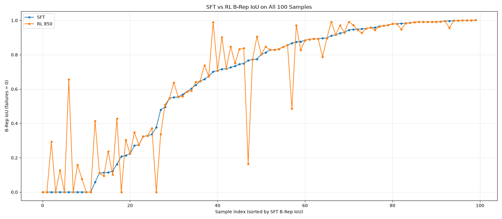

# Qwen 3.5-4B Image to Cadquery Generation

This repository finetunes a vision language model to generate CadQuery Python code from images of 3D CAD models. 

I use a vision language model in the hope that it can better translate a CAD image into executable CadQuery code, as compared with converting the image to embeddings and feeding the same to a regular language model.

## Dataset

I use the [CADCODER/GenCAD-Code](https://huggingface.co/datasets/CADCODER/GenCAD-Code) dataset, which contains CAD images paired with CadQuery code.

The dataset was introduced in [CAD-Coder: An Open-Source Vision-Language Model for Computer-Aided Design Code Generation](https://arxiv.org/abs/2505.14646). The original CAD-Coder repository can be found [here](https://github.com/anniedoris/CAD-Coder).

The training set contains approximately **147k image/code pairs**.

Each training example consists of:

- An image of a CAD model
- The ground-truth CadQuery Python code

The model is trained to predict only the CadQuery response (image and instruction not included in the loss)

## Zero-Shot Accuracy

Over a held out set of 200 samples, the model was unable to successfully produce a single valid geometry. While the code produced by the model qualitatively looked good, it had a lot of syntax issues (i.e. calling cq.WorkPlane instead of cq.Workplane, making up methods that did not exist).

## Fine-Tuning

Finetuned Qwen3.5-4B using LoRA:

- **Model:** Qwen3.5-4B
- **Dataset:** CADCODER/GenCAD-Code
- **Method:** LoRA / supervised fine-tuning
- **Training data:** ~147k examples
- **Image resolution:** 448 × 448
- **LoRA rank:** 16
- **LoRA alpha:** 32
- **Learning rate:** 2e-4
- **Effective batch size:** 16

The training code and notebooks in this repository contain the preprocessing, training and evaluation pipeline.

## Evaluation

The generated CadQuery code is executed to reconstruct the CAD geometry. The generated geometry is then compared against the reference geometry using voxel IoU.

My current SFT checkpoint is **step 27618 (3 epochs)**.

For the final SFT vs RL comparison, evaluation was performed on the 100 samples marked as `hundred_subset` in the GenCAD-Code test split.

The IoU values below were computed using a voxel IoU evaluator, mean and median are evaluated over samples for which the evaluation completed successfully. 

The same evaluator was used to compute the reward for RL.

### SFT Baseline

| Metric | Result |
| --- | --- |
| Mean IoU | 0.5887 |
| Median IoU | 0.6136 |
| Std. Dev. | 0.3830 |
| Successful samples | 88 / 100 |

Unlike the zero-shot model, the fine-tuned model is able to consistently generate executable CadQuery geometries.

This is the current SFT baseline that I am using for further experiments.

## Reinforcement Learning

I used this SFT model as the starting point for further fine-tuning with reinforcement learning. The idea is to have the model generate CadQuery code, execute it to produce the corresponding geometry, and use the resulting voxel IoU (computed after comparing the produced geometry v/s the ground truth geometry) as a reward, hoping that the model is able to get a better understanding of the geometry itself.

For this experiment, I use GRPO over 5,000 samples from the original training split for one epoch (1,250 steps), with 8 generations per prompt.

The 5,000 samples had already been seen during SFT, but the optimization objective is different. SFT optimizes next-token prediction against the ground-truth code, while GRPO directly optimizes the geometric reward (in this case the IoU between the CAD object generated based on the code from the model v/s the object generated from the ground truth code).

The RL run was significantly slower because each step requires generating multiple relatively long CadQuery programs, executing them, and evaluating the resulting geometry.

Step 850 was selected based on the validation reward before running the final test evaluation.

### Voxel IoU

Using the same voxel IoU evaluator as the SFT model:

| Metric | SFT | RL (step 850) |
| --- | --- | --- |
| Successful samples | 88 / 100 | 92 / 100 |
| Mean IoU | 0.5887 | 0.5918 |
| Median IoU | 0.6136 | 0.6894 |

### B-Rep IoU

I also evaluated the same outputs using the B-Rep IoU evaluator released with CAD-Coder.

For the metrics below, failed or non-evaluable samples are assigned an IoU of 0.

| Metric | SFT | RL (step 850) |
| --- | --- | --- |
| B-Rep evaluable samples | 88 / 100 | 91 / 100 |
| Mean IoU | 0.6520 | 0.6685 |
| Median IoU | 0.7887 | 0.8304 |

For the 86 samples which were B-Rep evaluable for both models:

| Metric | SFT | RL (step 850) |
| --- | --- | --- |
| Mean IoU | 0.7514 | 0.7621 |
| Median IoU | 0.8614 | 0.8703 |

Of these 86 samples, 26 improved after RL, 20 worsened, and 40 remained unchanged.

The RL model also generated 5 geometries which were failing with the earlier SFT model, while 2 samples that were valid with SFT were no longer evaluable after RL.

The graph shows the B-Rep IoU for all 100 test samples, sorted by the SFT IoU. Failed or non-evaluable samples are assigned an IoU of 0.

## Future Work

The RL experiment was run on only 5,000 samples for one epoch, compared with the ~147k samples used during SFT.

Some directions I would like to explore further are:

- Make geometry computation more efficient for faster RL results
- Run RL on the rest of the data for longer with more compute
- Train using multiple views of each CAD model
- Have the VLM first describe or reason about the geometry before generating the CadQuery code
- Use richer geometric rewards beyond voxel IoU (include topological similarity, for example)
